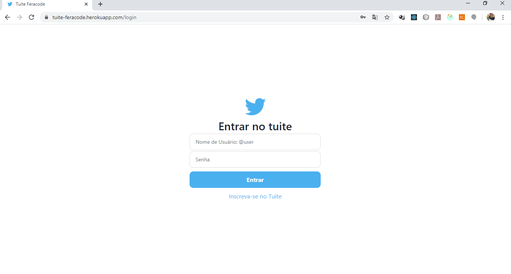
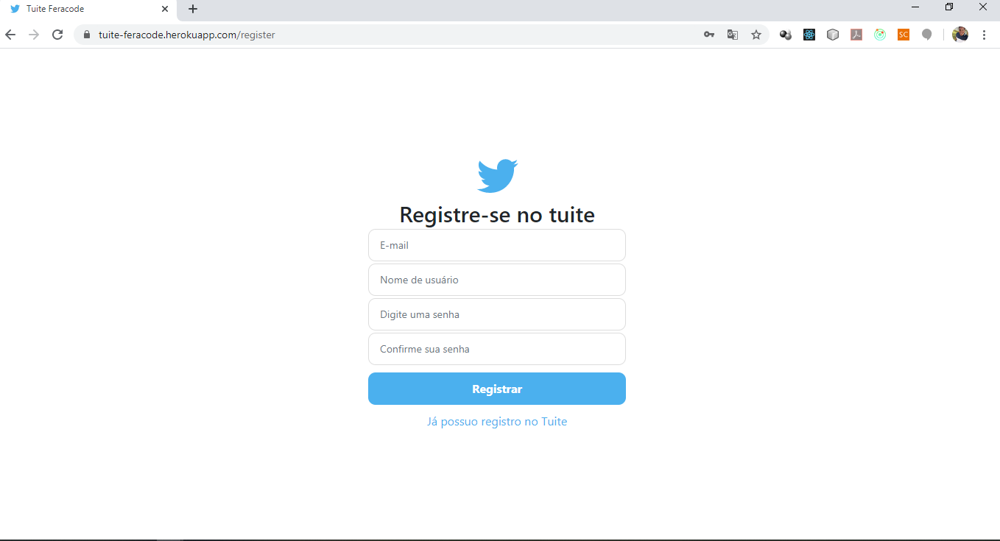
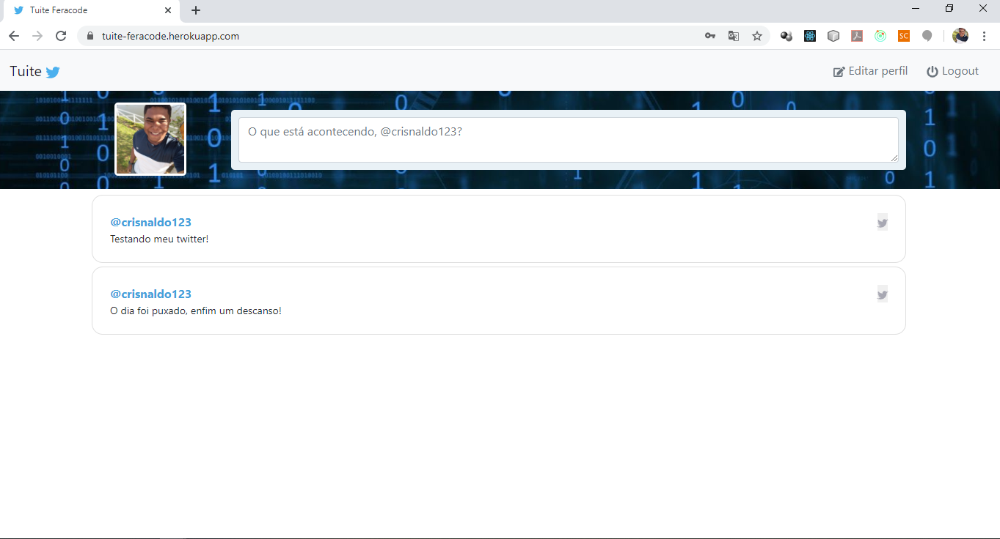
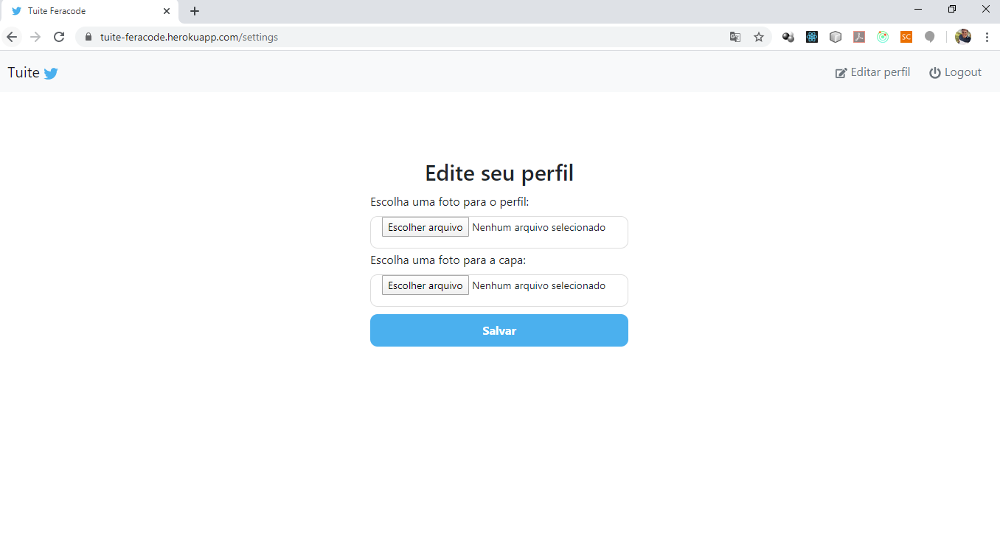

<h1 align="center">
  
  <br/>
    Tuite-Feracode
</h1>

<p align="center">
  

  <a href="https://www.crisnaldocarvalho.com.br">
    
  </a>
</p>

<p>Aplicação criada para o teste prático proposto pela Empresa Feracode para vagas de front-end ReactJS.</p>


## Descrição:

<p> A aplicação imita interfaces do Twitter, permitindo que o usuário se registre, faça login, edite suas informações e poste em sua timeline.
Foi construído um back-end em NodeJS e tanto o front quanto o back foram hospedados no Heroku Server </p>
A aplicação pode ser acessada através  de <a href="https://tuite-feracode.herokuapp.com/">https://tuite-feracode.herokuapp.com/</a>
<p>
A hospedagem gratuita do heroku hiberna os servidores em 30 minutos de inatividade, portanto um primeiro acesso pode levar um tempo maior.
</p>
<p> Para tuitar na sua timeline, basta escrever o texto e teclar ENTER.
</p>

## Tenologias:
- NodeJS com Express
- React JS
- Redux
- Azure Blobs
- MongoDB

## Executando Localmente:
Realize o clone ou download do repositório.

### backend:
<p>Abra o diretório 'backend' em seu editor de código preferido. </p>
<p>
Renomeio o arquivo '.env.example' para '.env', e preenchas as variáveis de ambiente com uma url de um banco MongoDB e as credenciais de uma conta de armazenamento da Azure.</p>
Acesso o diretório pelo seu terminal e utilize os comandos para instalar as dependências e iniciar o servidor, respectivamente:</p>

```js
yarn install  //npm install *para quem está ulitizando o npm como gerenciador de dependências*
yarn start  //npm start
```

### frontend:

Acesso o diretório pelo seu terminal e utilize os comandos para instalar as dependências e iniciar o servidor, respectivamente:</p>
```js
yarn install  //npm install *para quem está ulitizando o npm como gerenciador de dependências*
yarn start  //npm start
```
## Screenshots:

<p align="center">
    
</p>
<p align="center">
    
</p>
<p align="center">
    
</p>
<p align="center">
    
</p>

## Licença:

Esse projeto está sob a licença MIT. Veja o arquivo [LICENSE](LICENSE.md) para mais detalhes.

---

Feito com ♥ by Crisnaldo Carvalho in Estância/SE
